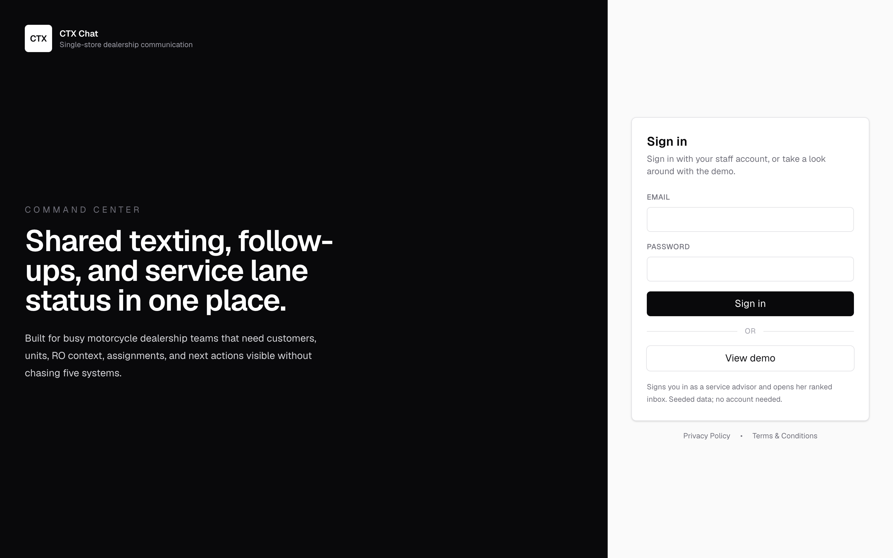
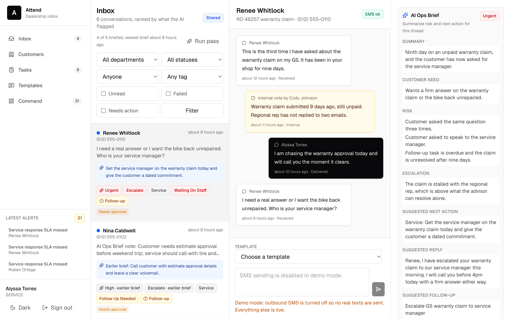
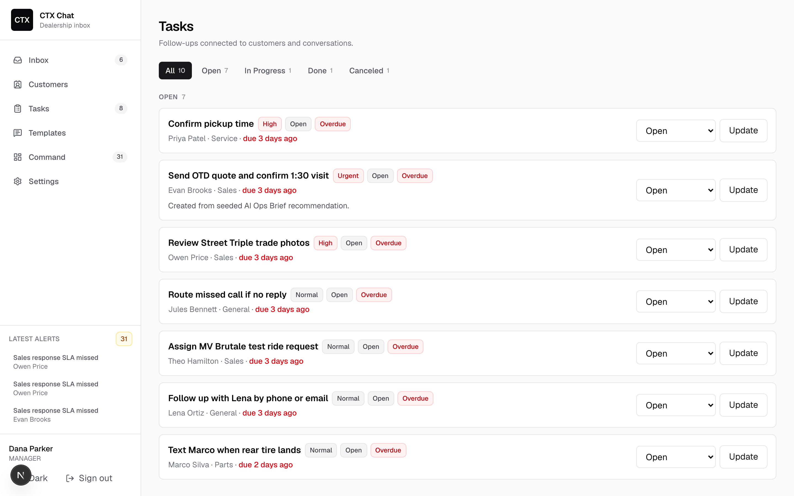

# CTX Connect

An AI-powered shared inbox for dealership service teams.

A service advisor can be juggling dozens of conversations at once: sales questions,
repair updates, parts arrivals, and customers who stopped responding days
ago. **CTX Connect turns that noise into a prioritized workflow.**

An ambient AI layer summarizes conversations as they evolve, identifies the
next action, and ranks the inbox by what actually needs attention, not
simply by which message arrived last.

### What it includes

- Shared customer texting across the dealership
- AI-generated conversation summaries and next steps
- Prioritized inbox for service advisors
- Follow-up tasks and team assignments
- Built-in SMS compliance and opt-out handling

## Screenshots

Screens below show the local demo UI, signed in as the service advisor.

| Login | Ranked inbox | Tasks |
| --- | --- | --- |
|  |  |  |

## Stack

- `Next.js` App Router
- `TypeScript`
- `Tailwind CSS`
- `Prisma 7`
- `Neon Postgres`
- `Auth.js` credentials login
- `Twilio` SMS/MMS route structure
- `Vercel` for local/preview/production deployment targets

## Environment Contract

`DATABASE_URL` is always the Neon pooled runtime URL used by the app at runtime.

`DIRECT_URL` is always the Neon direct connection used by Prisma CLI commands and one-time admin scripts.

Required app env:

- `DATABASE_URL`
- `NEXTAUTH_SECRET`
- `NEXTAUTH_URL`
- `NEXT_PUBLIC_APP_URL`

Required CLI/bootstrap env:

- `DIRECT_URL`
- `BOOTSTRAP_ADMIN_NAME`
- `BOOTSTRAP_ADMIN_EMAIL`
- `BOOTSTRAP_ADMIN_PASSWORD`

Twilio env:

- `TWILIO_ACCOUNT_SID`
- `TWILIO_AUTH_TOKEN`
- `TWILIO_PHONE_NUMBER` or `TWILIO_MESSAGING_SERVICE_SID`

AI env:

- `OPENAI_API_KEY`
- `OPENAI_MODEL` defaults to `gpt-4.1-mini` when unset
- `AI_PASS_MAX_BRIEFS` caps how many conversations one ambient pass will brief, defaults to `12`
- `SEED_AI_BRIEFS` set to `false` to stop the seed regenerating its briefs through the real model

Demo and cron env:

- `DEMO_USER_EMAIL` names the demo account, see `Demo Mode`
- `DEMO_AI_DAILY_LIMIT` caps how many briefs the demo account can generate per rolling 24h, defaults to `20`. An explicit `0` is honoured and turns live demo AI off; blank, unset, or unparseable falls back to the default rather than to zero
- `CRON_SECRET` authorizes the scheduled `GET /api/demo/reseed` and `GET /api/ai/sweep` routes
- `SEED_PASSWORD` is required before demo data can be seeded in production
- `NEXT_PUBLIC_TURNSTILE_SITE_KEY` and `TURNSTILE_SECRET_KEY` gate the `View demo` button; without the secret, verification is skipped outside production and refused in production

## Local Setup

1. Copy `.env.example` to `.env`.
2. Point `DATABASE_URL` at the Neon non-production `dev` branch pooled URL.
3. Point `DIRECT_URL` at the matching Neon non-production `dev` branch direct URL.
4. Generate the Prisma client:

```bash
pnpm prisma:generate
```

1. Apply local development migrations:

```bash
pnpm prisma:migrate
```

1. Seed local demo data:

```bash
pnpm prisma:seed
```

1. Start the app:

```bash
pnpm dev
```

## Seeded Local Logins

`prisma/seed.ts` is for local development only. All seeded users use password `ctxdemo123`.

- `admin@ctxchat.local`
- `gm@ctxchat.local`
- `sales@ctxchat.local`
- `service@ctxchat.local`
- `parts@ctxchat.local`

The local seed creates a portfolio-ready demo state with staff users, demo customers, conversations, tasks, notifications, tags, templates, AI Ops Brief insights, and product analytics events. Do not use it for production initialization.

The seed uses fictional customer data. It always writes a hand-written fallback
brief for each demo conversation so the app is never empty and never depends on a
provider being up.

When `OPENAI_API_KEY` is set, the seed then regenerates those same briefs through
the real inference path, so a viewer sees genuine model output rather than text
someone typed. A conversation whose call fails keeps its written fallback, which is
why the demo cannot break on a provider outage. Each regenerated brief is a paid
call; set `SEED_AI_BRIEFS=false` to skip that step and keep the written text.

One exception, stated because it is a real one: a short list of fields that
[docs/demo-script.md](docs/demo-script.md) quotes word for word is held across
regeneration, so a reseed cannot leave the script describing a screen that says
something else. Those specific values are written rather than inferred even when a
key is present. They are listed in `demoScriptPinnedFields` in `src/lib/demo-seed.ts`
and cover two conversations; every other field on every brief is model output.

## The Ambient AI Pass

The AI ops brief does not wait to be asked. A background pass briefs every
conversation that needs one, so the inbox is ranked before an advisor opens it.

A conversation is eligible when it is not closed, a customer has sent at least one
message in it, and no brief exists that is newer than its last activity. That last
clause is what keeps the pass affordable: an unchanged thread is never re-briefed, so
re-running the pass costs nothing until something actually happens.

Entry points:

- `GET /api/ai/sweep`, authorized with `CRON_SECRET`. Scheduled daily in
  `vercel.json`, after the demo reseed. It skips the one thread the seed
  deliberately leaves stale, matched on the seeded customer in
  `src/lib/demo-fixtures.ts`, so the reseed's curated state lasts the whole day
  instead of until the sweep runs. `Run pass` is a person asking, so it still
  briefs it.
- `Run pass` in the inbox header, which runs the same pass scoped to the
  conversations the signed-in user can see, and reports what it did.

Each brief is a paid model call. `AI_PASS_MAX_BRIEFS` bounds a single run, and the
shared demo account is additionally bounded by `DEMO_AI_DAILY_LIMIT`.

`Run pass` is a Server Action, so it runs inside the serverless invocation that
rendered the page it was clicked on, and its time budget has to cover the same
sequential model calls the cron route makes. `AI_PASS_MAX_BRIEFS` alone does not fit
inside that budget: twelve calls against a thirty second provider timeout is 360
seconds against a 300 second invocation, so a degraded provider used to have the
invocation killed mid-pass and the briefs already written reported as nothing having
happened. Every loop that calls the model one conversation at a time therefore asks
`startBriefBudget` in `src/lib/ai/ops-brief.ts` before each call and reports what it
managed once the answer is no. The clock starts where the invocation starts and is
passed down, so whatever ran before the first brief draws down the same budget.
There are two loops: the ambient pass, behind `/api/ai/sweep`, `/inbox` and
`/inbox/[conversationId]`, which counts the rest as left for the next pass; and the
seed's regeneration of its own written briefs, behind `/api/demo/reseed`, where the
destructive recreate spends the budget first and the rest stay on their hand-written
fallback. `pnpm prisma:seed` passes no budget and regenerates all of them,
because a terminal has no invocation to fit inside. The deadline is derived from the
invocation budget and the provider timeout rather than typed, so raising
`AI_PASS_MAX_BRIEFS` or adding seeded conversations cannot reopen the overrun.

Still hand-maintained: `INVOCATION_BUDGET_MS` in that file has to match `maxDuration`
in those four routes.

Known limit: `DEMO_AI_DAILY_LIMIT` is read and then spent, with no reservation in
between, so two people who click `Run pass` on the shared demo account at the same
moment both see the full remaining quota and both run a full pass. Before the ambient
pass existed the same race could overspend by one brief; a pass can now overspend by
up to `AI_PASS_MAX_BRIEFS` briefs, which at the default of 12 is roughly a quarter of
a dollar. It is accepted rather than fixed: the alternative is capping the pass below
what it needs to read every conversation. Not mitigated, and it needs simultaneous
clicks to happen at all.

Known limit: the staleness check runs in application code, so picking candidates means
loading every non-closed conversation that has an inbound message and filtering them
in memory. That candidate scan is unbounded, and it does not run only on a pass: the
inbox header's `N of M briefed` line is counted over exactly the same candidate set,
so the scan also runs on every `/inbox` load, every filter change, and every thread
open. It is a second query of a shape the inbox already runs, since the conversation
list itself is loaded unbounded on every render, rather than a new kind of cost. It is
fine at dealership volume and would need bounding if conversation volume grew
materially.

Without `OPENAI_API_KEY` the pass writes nothing, the inbox says AI is not
configured, and no brief is ever fabricated.

## Demo Mode

`DEMO_USER_EMAIL` names the account the login page's `View demo` button signs into.
It is `service@ctxchat.local` (Alyssa Torres, service advisor) because the service
advisor is the product's primary user - the demo has to land inside her work, not on
a manager's dashboard. The demo session lands on `/inbox`.

Leaving `DEMO_USER_EMAIL` unset hides the button and disables the demo provider.

Required on deploy: `.env.example` is a template, not configuration. An environment
deployed before this value changed keeps whatever `DEMO_USER_EMAIL` it was given,
which for earlier deploys is the manager account `gm@ctxchat.local`. Set
`DEMO_USER_EMAIL=service@ctxchat.local` in the deployed environment and redeploy, or
the demo still opens on a manager.

## Production Bootstrap

On a brand-new production database:

1. Set production `DATABASE_URL` to the Neon pooled production URL.
2. Set production `DIRECT_URL` to the Neon direct production URL.
3. Set `BOOTSTRAP_ADMIN_NAME`, `BOOTSTRAP_ADMIN_EMAIL`, and `BOOTSTRAP_ADMIN_PASSWORD`.
4. Run migrations:

```bash
pnpm prisma:migrate:deploy
```

1. Run the one-time bootstrap:

```bash
pnpm bootstrap:prod
```

`bootstrap:prod` creates only:

- the first `ADMIN` user
- default dealership settings
- required tags
- starter templates

It intentionally does not create demo customers, conversations, or tasks. It also refuses to run if users already exist.

## Vercel + Neon Deployment Model

Use one `Vercel` project for the full app and one `Next.js` codebase.

- Local envs point at the Neon non-production `dev` branch.
- Preview envs point at the shared Neon non-production `preview` branch.
- Production envs point at the dedicated Neon production database or branch.

Before validating a preview or production deploy, run Prisma migrations against that environment's `DIRECT_URL`.

Preview / production command:

```bash
pnpm prisma:migrate:deploy
```

Vercel deployment and Twilio webhook setup details live in [docs/vercel-twilio-deploy.md](docs/vercel-twilio-deploy.md).

## Twilio

Routes:

- `POST /api/messages/send`
- `POST /api/twilio/inbound`
- `POST /api/twilio/status`

Production SMS in the US requires approved A2P 10DLC registration before sending dealership traffic.

Webhook verification is strict in local, preview, and production:

- `POST /api/twilio/inbound` and `POST /api/twilio/status` only accept Twilio-signed `application/x-www-form-urlencoded` requests with a valid `X-Twilio-Signature`.
- Signature verification uses the existing `TWILIO_AUTH_TOKEN` and the exact incoming `request.url`. There is no separate signing URL env.
- If `TWILIO_AUTH_TOKEN` is missing, webhook routes return `503` and do not mutate app data.
- If the Twilio signature is missing or invalid, webhook routes return `403` and do not mutate app data.
- Signed but unusable payloads, including incomplete inbound messages or unknown outbound status SIDs, return `200 ignored`.

Local and preview webhook setup:

- Use a real public tunnel or public callback URL. Twilio cannot sign requests against `localhost`.
- Point Twilio’s inbound and status callback URLs at that public URL.
- Ensure the URL seen by the app matches the signed request URL exactly, including protocol and host, or verification will fail.
- For manual replay testing, reuse the original signed payload and `MessageSid` to confirm duplicate inbound/status requests return `200` without creating duplicate rows or notifications.
- A step-by-step local validation runbook and replay utility live in [docs/twilio-local-verification.md](docs/twilio-local-verification.md). Use `pnpm twilio:replay` to send valid, missing-signature, or invalid-signature Twilio form posts at the public webhook URL.
- For deployed webhook testing on Vercel instead of a local tunnel, use [docs/vercel-twilio-deploy.md](docs/vercel-twilio-deploy.md).

## Operations Notes

- `/settings` is available to `ADMIN` and `MANAGER`.
- `ADMIN` can create staff users, deactivate/reactivate them, reset passwords, and update dealership defaults.
- Integration health on `/settings` reports database, auth, app URL, and Twilio readiness plus recent outbound delivery failures.

## Out Of Scope In This Slice

- `Stripe` payment flows
- Stripe signature verification hardening
- CI-driven migration automation
- Branch-per-preview Neon automation
